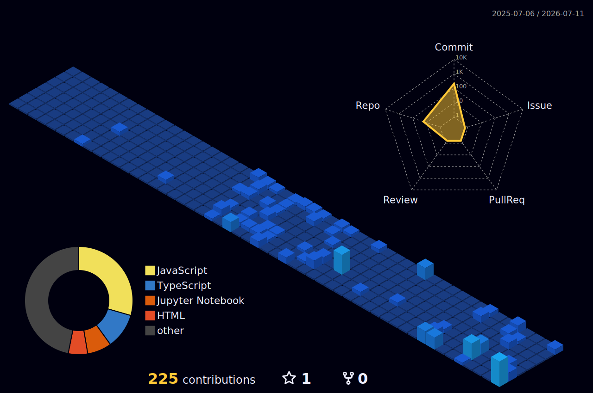
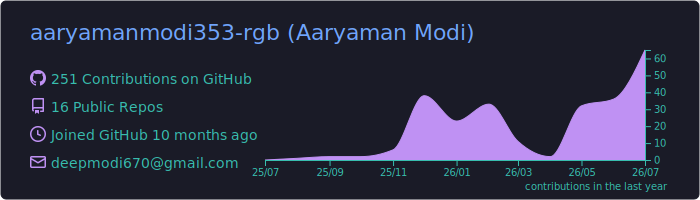

  

 

## 👨‍💻 About Me

- 🎓 Currently pursuing my **B.Tech in Computer Science and Engineering** at **VIT Bhopal** (GPA: 8.77/10).
- 💻 Primary focus on **Java** and **C++** for core development, alongside architecting scalable applications using the MERN stack and Next.js.
- 💼 **Intern at ServiceNow (May 2026 - Jun 2026):** Focused on ServiceNow Administration, automated reporting frameworks, and gained hands-on experience with Agentic AI and Automated Test Frameworks (ATF).
- 💼 **Full Stack Developer Intern at Unified Mentor (Feb 2026 - Apr 2026):** Engineered full-cycle platforms including *Rent Mojo* and *Entré Skill Hub*, designing scalable MongoDB schemas that reduced API data retrieval latency by 20%.
- 📫 Reach me at **deepmodi670@gmail.com**

 

## 🚀 Featured Endeavors

| 🛍️ Product AI: Price Optimization | 🛒 TechNova E-Commerce | 📄 ATS-AI (ResumeIQ) |
|:---|:---|:---|
| An end-to-end ML system predicting optimal e-commerce prices using **NLP and TF-IDF vectorization**, featuring a predictive regression pipeline via a **FastAPI** backend and React.js frontend. | A high-performance platform built with a **Java Spring Boot** backend and **Next.js 16** frontend, incorporating stateless JWT authentication and dynamic UPI payment flows. | An enterprise **MERN** optimization platform featuring a Deterministic 6-Pillar Scoring Engine, N-gram keyword extraction, and an AI-powered Bullet Rewrite Coach. |

 

## 🛠️ Technologies

**Core Languages & Databases**
 

**Web Development**
 

**AI, Cloud & Tooling**
 

 

## 📜 Certifications

- Oracle Gen AI Professional Certification
- Oracle Gen AI Foundation Certification
- Google IT Support: Bits and Bytes of Computer Networking
- AWS Certified Solutions Architect (In Progress)

 

  
<b>🏆 View Hackathons & Achievements</b>

   
  
  | Rank | Event | Highlight |
  |:---:|:---|:---|
  | 🏅 5th | India's Biggest Student Cloud Hackathon | Cloud architecture and deployment (1.5K+ developers) |
  | 🥈 2nd | Glitch the System Hackathon | Programmed a functional rebadging website on Replit |
  | ✅ Qualifier | TCS CodeVita Round 1 | Global competitive programming contest |

 

## 🧊 3D Contribution Graph

  

 

## ⚡ GitHub & LeetCode Stats

  

<table>
  <tr>
    <td align="center" valign="middle">
      <b>🔥 GitHub Streak</b>  
      
    </td>
    <td align="center" valign="middle">
      <b>🏆 LeetCode Badges</b>  
      
      
      
    </td>
  </tr>
</table>

 

### 🤝 Let's Connect

  

