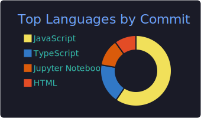

  

 

## 👨‍💻 About Me

- 🎓 Currently pursuing my **B.Tech in Computer Science and Engineering** at **VIT Bhopal**.
- 💻 Primary focus on **Java** and **C++** for core development, alongside architecting scalable applications using the MERN stack and Tailwind CSS.
- 💼 **Web Development Intern at Unified Mentor (Feb 2026 - Apr 2026):** Engineered full-stack platforms including *Rent Mojo* (a rental marketplace) and *Entré Skill Hub* (a startup platform).
- 📫 Reach me at **deepmodi670@gmail.com**

 

## 🚀 Featured Endeavors

| 🤖 AI Interview Prep Platform | 🏎️ IoT Command Car | 📝 AI Text Summarizer |
|:---|:---|:---|
| A comprehensive interview preparation platform powered by the **Google Gemini API**, designed to simulate real-world technical assessments. | A custom-built IoT vehicle engineered to receive and execute real-time operational commands directly from a laptop interface. | An intelligent text summarizer leveraging Large Language Models to distill complex information into concise, readable formats. |

 

## 🛠️ Technologies

**Core Languages & Databases**
 

**Web Development**
 

**AI, Cloud & Tooling**
 

 

## 📜 Certifications

- AWS Certified Solutions Architect (In Progress)
- Google Networking Certification

 

  
<b>🏆 View Hackathons & Achievements</b>

   
  
  | Rank | Event | Highlight |
  |:---:|:---|:---|
  | 🏅 5th | India's Biggest Student Cloud Hackathon | Cloud architecture and deployment |
  | 🥈 2nd | Glitch the System Hackathon | Built a functional rebadging site under time pressure |
  | ✅ Qualifier | TCS CodeVita Round 1 | Global competitive programming contest |

 

## 🧊 3D Contribution Graph

  

 

## ⚡ GitHub Stats & Commit Activity

<!-- Updated with the correct filenames from the workflow output -->

  

 

### 🤝 Let's Connect

  

